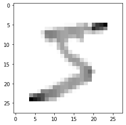
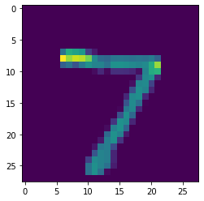

```python
import tensorflow as tf

mnist = tf.keras.datasets.mnist # 28x28 images of 0-9 digits handwritten

(x_train, y_train),(x_test, y_test) = mnist.load_data() # unpacking

x_train = tf.keras.utils.normalize(x_train, axis=1)
x_test = tf.keras.utils.normalize(x_test, axis=1)

model = tf.keras.models.Sequential()
model.add(tf.keras.layers.Flatten())
model.add(tf.keras.layers.Dense(128, activation=tf.nn.relu))
model.add(tf.keras.layers.Dense(128, activation=tf.nn.relu))
model.add(tf.keras.layers.Dense(10, activation=tf.nn.softmax))

model.compile(optimizer='adam', loss='sparse_categorical_crossentropy', metrics=['accuracy'])

model.fit(x_train, y_train, epochs=3)
# two hidden layers
    
```

    Epoch 1/3
    1875/1875 [==============================] - 3s 1ms/step - loss: 0.2704 - accuracy: 0.9212
    Epoch 2/3
    1875/1875 [==============================] - 3s 1ms/step - loss: 0.1114 - accuracy: 0.9662
    Epoch 3/3
    1875/1875 [==============================] - 2s 1ms/step - loss: 0.0751 - accuracy: 0.9764


    <tensorflow.python.keras.callbacks.History at 0x142ecca60>


```python
import matplotlib.pyplot as plt

plt.imshow(x_train[0], cmap = plt.cm.binary) # color map to b&w
plt.show() # the actual image

print(x_train[0]) # tensor

```





    [[0.         0.         0.         0.         0.         0.
      0.         0.         0.         0.         0.         0.
      0.         0.         0.         0.         0.         0.
      0.         0.         0.         0.         0.         0.
      0.         0.         0.         0.        ]
     [0.         0.         0.         0.         0.         0.
      0.         0.         0.         0.         0.         0.
      0.         0.         0.         0.         0.         0.
      0.         0.         0.         0.         0.         0.
      0.         0.         0.         0.        ]
     [0.         0.         0.         0.         0.         0.
      0.         0.         0.         0.         0.         0.
      0.         0.         0.         0.         0.         0.
      0.         0.         0.         0.         0.         0.
      0.         0.         0.         0.        ]
     [0.         0.         0.         0.         0.         0.
      0.         0.         0.         0.         0.         0.
      0.         0.         0.         0.         0.         0.
      0.         0.         0.         0.         0.         0.
      0.         0.         0.         0.        ]
     [0.         0.         0.         0.         0.         0.
      0.         0.         0.         0.         0.         0.
      0.         0.         0.         0.         0.         0.
      0.         0.         0.         0.         0.         0.
      0.         0.         0.         0.        ]
     [0.         0.         0.         0.         0.         0.
      0.         0.         0.         0.         0.         0.
      0.00393124 0.02332955 0.02620568 0.02625207 0.17420356 0.17566281
      0.28629534 0.05664824 0.51877786 0.71632322 0.77892406 0.89301644
      0.         0.         0.         0.        ]
     [0.         0.         0.         0.         0.         0.
      0.         0.         0.05780486 0.06524513 0.16128198 0.22713296
      0.22277047 0.32790981 0.36833534 0.3689874  0.34978968 0.32678448
      0.368094   0.3747499  0.79066747 0.67980478 0.61494005 0.45002403
      0.         0.         0.         0.        ]
     [0.         0.         0.         0.         0.         0.
      0.         0.12250613 0.45858525 0.45852825 0.43408872 0.37314701
      0.33153488 0.32790981 0.36833534 0.3689874  0.34978968 0.32420121
      0.15214552 0.17865984 0.25626376 0.1573102  0.12298801 0.
      0.         0.         0.         0.        ]
     [0.         0.         0.         0.         0.         0.
      0.         0.04500225 0.4219755  0.45852825 0.43408872 0.37314701
      0.33153488 0.32790981 0.28826244 0.26543758 0.34149427 0.31128482
      0.         0.         0.         0.         0.         0.
      0.         0.         0.         0.        ]
     [0.         0.         0.         0.         0.         0.
      0.         0.         0.1541463  0.28272888 0.18358693 0.37314701
      0.33153488 0.26569767 0.01601458 0.         0.05945042 0.19891229
      0.         0.         0.         0.         0.         0.
      0.         0.         0.         0.        ]
     [0.         0.         0.         0.         0.         0.
      0.         0.         0.         0.0253731  0.00171577 0.22713296
      0.33153488 0.11664776 0.         0.         0.         0.
      0.         0.         0.         0.         0.         0.
      0.         0.         0.         0.        ]
     [0.         0.         0.         0.         0.         0.
      0.         0.         0.         0.         0.         0.20500962
      0.33153488 0.24625638 0.00291174 0.         0.         0.
      0.         0.         0.         0.         0.         0.
      0.         0.         0.         0.        ]
     [0.         0.         0.         0.         0.         0.
      0.         0.         0.         0.         0.         0.01622378
      0.24897876 0.32790981 0.10191096 0.         0.         0.
      0.         0.         0.         0.         0.         0.
      0.         0.         0.         0.        ]
     [0.         0.         0.         0.         0.         0.
      0.         0.         0.         0.         0.         0.
      0.04586451 0.31235677 0.32757096 0.23335172 0.14931733 0.00129164
      0.         0.         0.         0.         0.         0.
      0.         0.         0.         0.        ]
     [0.         0.         0.         0.         0.         0.
      0.         0.         0.         0.         0.         0.
      0.         0.10498298 0.34940902 0.3689874  0.34978968 0.15370495
      0.04089933 0.         0.         0.         0.         0.
      0.         0.         0.         0.        ]
     [0.         0.         0.         0.         0.         0.
      0.         0.         0.         0.         0.         0.
      0.         0.         0.06551419 0.27127137 0.34978968 0.32678448
      0.245396   0.05882702 0.         0.         0.         0.
      0.         0.         0.         0.        ]
     [0.         0.         0.         0.         0.         0.
      0.         0.         0.         0.         0.         0.
      0.         0.         0.         0.02333517 0.12857881 0.32549285
      0.41390126 0.40743158 0.         0.         0.         0.
      0.         0.         0.         0.        ]
     [0.         0.         0.         0.         0.         0.
      0.         0.         0.         0.         0.         0.
      0.         0.         0.         0.         0.         0.32161793
      0.41390126 0.54251585 0.20001074 0.         0.         0.
      0.         0.         0.         0.        ]
     [0.         0.         0.         0.         0.         0.
      0.         0.         0.         0.         0.         0.
      0.         0.         0.06697006 0.18959827 0.25300993 0.32678448
      0.41390126 0.45100715 0.00625034 0.         0.         0.
      0.         0.         0.         0.        ]
     [0.         0.         0.         0.         0.         0.
      0.         0.         0.         0.         0.         0.
      0.05110617 0.19182076 0.33339444 0.3689874  0.34978968 0.32678448
      0.40899334 0.39653769 0.         0.         0.         0.
      0.         0.         0.         0.        ]
     [0.         0.         0.         0.         0.         0.
      0.         0.         0.         0.         0.04117838 0.16813739
      0.28960162 0.32790981 0.36833534 0.3689874  0.34978968 0.25961929
      0.12760592 0.         0.         0.         0.         0.
      0.         0.         0.         0.        ]
     [0.         0.         0.         0.         0.         0.
      0.         0.         0.04431706 0.11961607 0.36545809 0.37314701
      0.33153488 0.32790981 0.36833534 0.28877275 0.111988   0.00258328
      0.         0.         0.         0.         0.         0.
      0.         0.         0.         0.        ]
     [0.         0.         0.         0.         0.         0.
      0.05298497 0.42752138 0.4219755  0.45852825 0.43408872 0.37314701
      0.33153488 0.25273681 0.11646967 0.01312603 0.         0.
      0.         0.         0.         0.         0.         0.
      0.         0.         0.         0.        ]
     [0.         0.         0.         0.         0.37491383 0.56222061
      0.66525569 0.63253163 0.48748768 0.45852825 0.43408872 0.359873
      0.17428513 0.01425695 0.         0.         0.         0.
      0.         0.         0.         0.         0.         0.
      0.         0.         0.         0.        ]
     [0.         0.         0.         0.         0.92705966 0.82698729
      0.74473314 0.63253163 0.4084877  0.24466922 0.22648107 0.02359823
      0.         0.         0.         0.         0.         0.
      0.         0.         0.         0.         0.         0.
      0.         0.         0.         0.        ]
     [0.         0.         0.         0.         0.         0.
      0.         0.         0.         0.         0.         0.
      0.         0.         0.         0.         0.         0.
      0.         0.         0.         0.         0.         0.
      0.         0.         0.         0.        ]
     [0.         0.         0.         0.         0.         0.
      0.         0.         0.         0.         0.         0.
      0.         0.         0.         0.         0.         0.
      0.         0.         0.         0.         0.         0.
      0.         0.         0.         0.        ]
     [0.         0.         0.         0.         0.         0.
      0.         0.         0.         0.         0.         0.
      0.         0.         0.         0.         0.         0.
      0.         0.         0.         0.         0.         0.
      0.         0.         0.         0.        ]]


```python
model.save('num_classifier.model')
```

    INFO:tensorflow:Assets written to: num_classifier.model/assets


```python
new_model = tf.keras.models.load_model('num_classifier.model')
```


```python
predictions = new_model.predict(x_test)
```


```python
import numpy as np

print(np.argmax(predictions[0]))
```

    7


```python
plt.imshow(x_test[0])
plt.show()
```





```python

```


```python

```


```python

```
